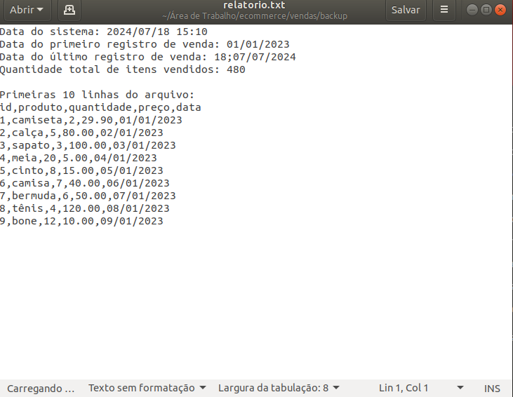

# Evidências 

Evidências e descrição referente ao desafio da sprint 01

## Passo 1

Criação dos arquivos processamento_de_vendas.sh e consolidador_de_vendas.sh, juntamente com a pasta ecommerce.

## Passo 2
Criação dos scripts em processamento_de_vendas.sh e consolidador_de_vendas.sh, tornando-os executaveis com o comando chmod +x $nomedoArquivo

## Passo 3
Criar o agendamento para a execução do arquivo processamento_de_vendas.sh, no crontab -e 

## Verificar resultados
Com a execução dos scripts, temos como resultado os arquivos: relatorio.txt e relatorio_final, e juntamente o arquivo zip da pasta como backup 

