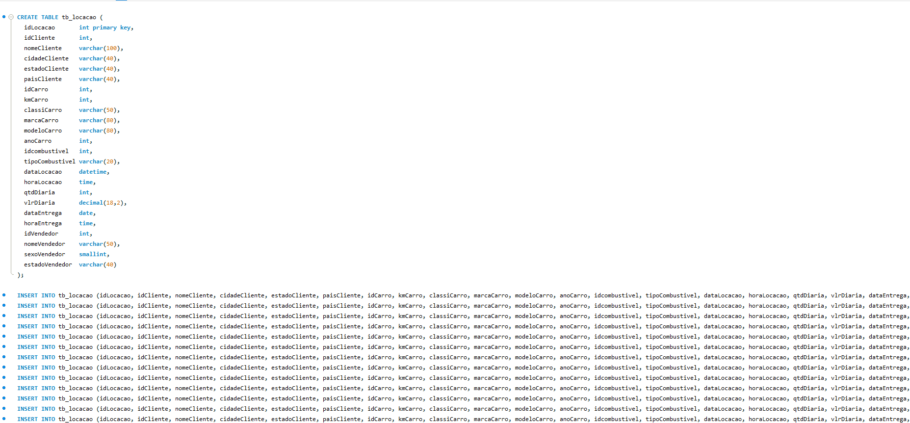
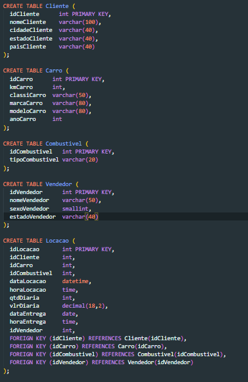
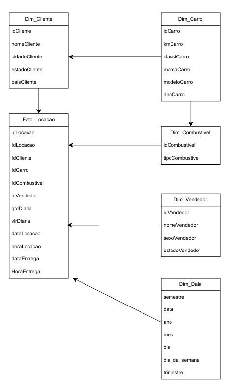
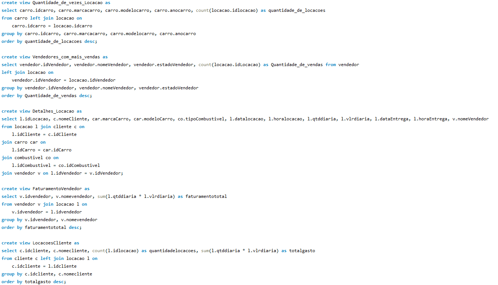
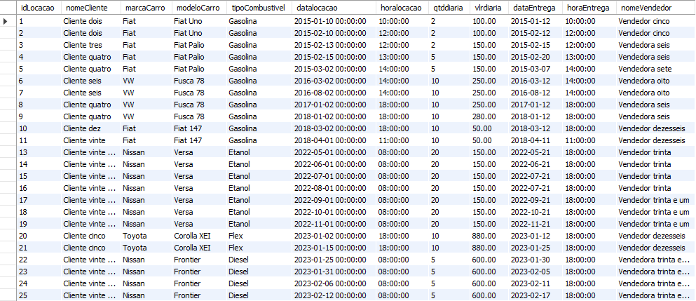
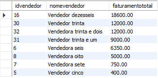
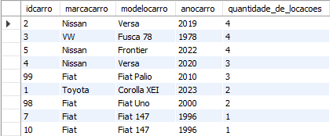
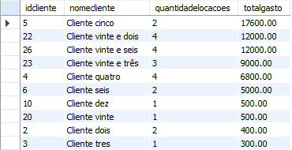
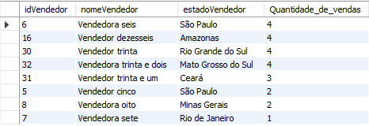

# Evidências 

Evidências e descrição referente ao desafio da sprint 02

## Passo 1

Análise do código raiz disponibilizdo do banco de dados concessionaria.

## Passo 2
Esboço da normalização, e, posteriormente finalização da estrutura do banco normalizado

## Passo 3
Criação das modelagens dimensionais e relacionais referentes ao banco normalizado

## Passo 4
Criação de views para facilitar a consulta de dados mais necessarios

## Resultados 

Detalhes das locações

Faturamento por vendedor

Quantidade de vezes que um carro foi locado

Valor gasto por clientes em locações

Vendedores com mais vendas

