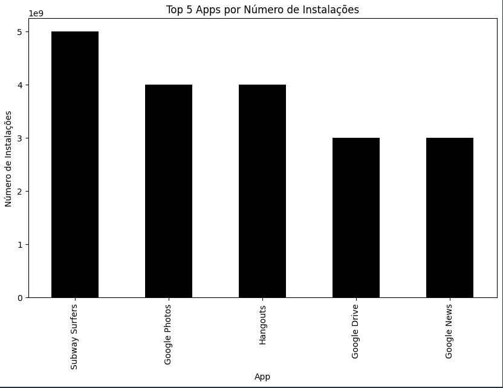
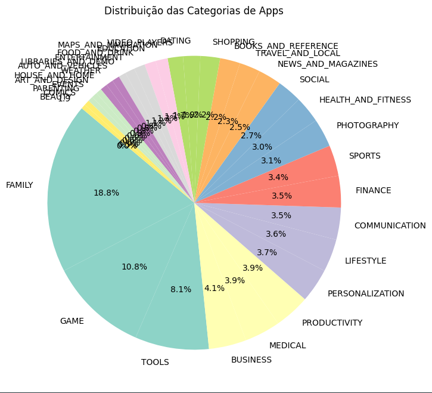
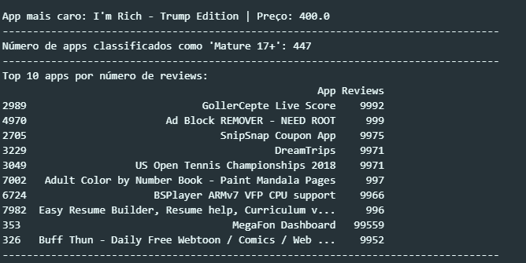
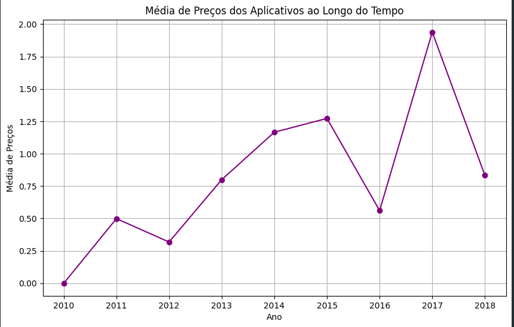
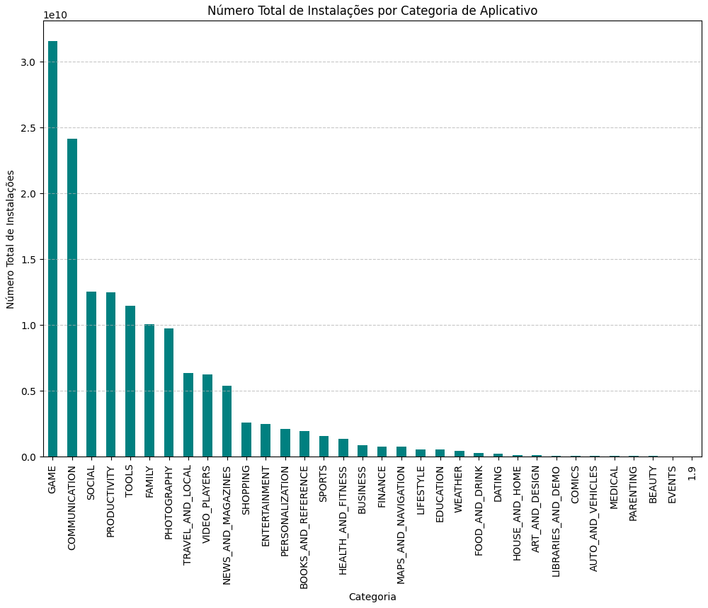

# **Evidencias**

## **Imagens finais representando a execução dos gráficos:**

### **Top 5 aplicativos por números de instalações**

### **Distribuição das Categorias de Apps**

### **Aplicativo mais caro, número de apps classificados como Mature 17+ e top 10 apps por número de reviews**

### **Média de Preços dos Aplicativos ao Longo do tempo**

### **Número Total de Instalações por Categoria de Aplicativo**

