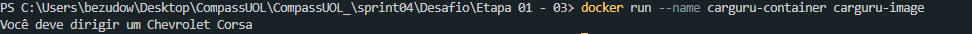
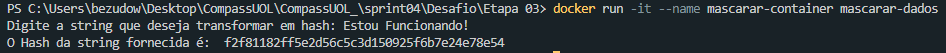

# **Evidencias**

## Imagens referente as execução dos containers

### Etapa 01 - 03
Apos executarmos o comando: *docker-run --name carguru-container carguru-image*

### Etapa 03
Apos executarmos o comando: *docker run -it --name mascarar-container mascarar-dados*
