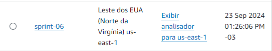
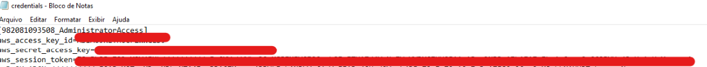
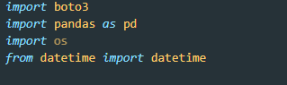
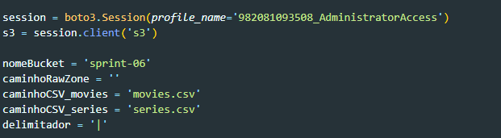
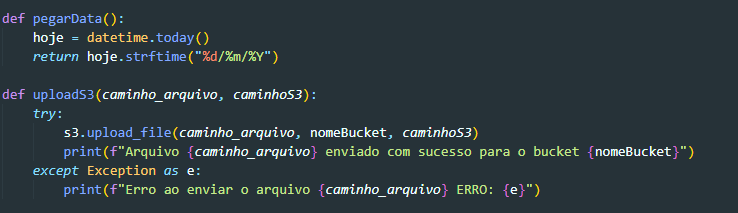
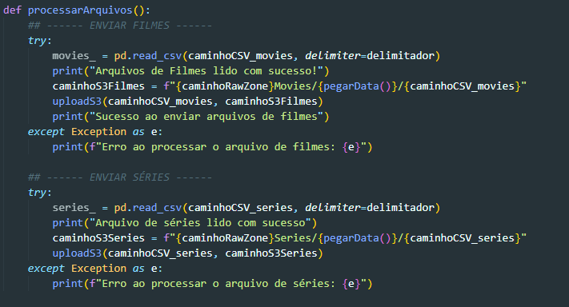
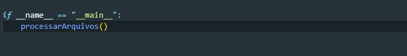
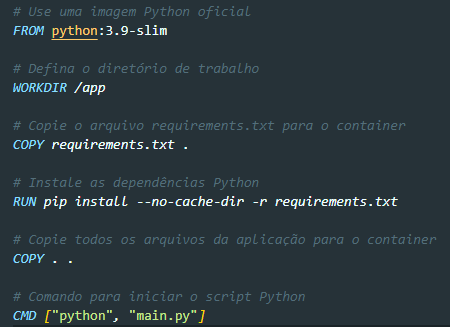
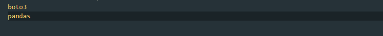

# **Desafio**
1. Objetivo: 
* Praticar a combinação de conhecimentos vistos no Programa, fazer um mix de tudo que já foi dito.
2. Atividade: 
* O desafio envolve a construção de um Data Lake que realiza a ingestão, processamento e consumo de dados sobre filmes e séries.

## Perguntas a serem respondidas
### 1. **Qual a relação entre a duração dos filmes e suas avaliações no TMDB e no IMDB?**
- Essa pergunta verifica a possibilidade de alguam relação entre a duração de um filme e sua avaliação nas plataformas.

### 2. **Quais diretores têm o maior número de filmes bem avaliados e quais gêneroes eles costumam dirigir ?**
 - Essa pergunta busca encontrar diretores que tenham maior número de filmes bem avaliados e analisar se eles tendem a dirigir determinados gêneros.

### 3. **Os filmes lançados em períodos como Natal, Ano Novo, e outras datas comemorativas têm avaliações melhores ou piores que os lançados em outras épocas ?**
- Fazemos a analise se filmes lançados em períodos festivos apresentam avaliações significativamente diferentes. 

### 4. **Quais são os gêneros de filmes mais comuns entre os filmes com maiores bilheterias?**
- Examinamos quais gêneros são mais populares entre os filmes que tiveram maior receita de bilheteria. 

### 5. **Qual a média de orçamento dos filmes, por década, e como isso evoluiu ao longo do tempo ?**
- Podemos estudar a evolução dos orçamentos dos filmes e podemos analisar o impacto da industria do entreternimento conforme o passar dos anos.

 **Entrega 01**

## Passo 1
**Foi adicionado ao gitignore os arquivos .csv, pois estava dando conflito para enviar ao repositorio por ser muito grande**
1. Preparação do Ambiente AWS:
    - Reutilizamos ou Criamos um bucket para a realização do Desafio
    
    - Atualizamos as credenciais da AWS, no meu caso, atualizamos na pasta .aws/credentials
    

## Passo 02
1. Importamos as bibliotecas necessarias para realizar o desafio


2. Criamos a sessão com o perfil selecionado e criamos as variaives necessárias para o código


3. Criamos as funções pegarData e uploadoS3, para pegar a data atual do sistema e para fazer upload do arquivo solicitado para o bucket, respectivamente


4. Criamos a função que fará a analise dos arquivos e chamara a função uploadS3, caso ocorrá algum erro será informado


5. Por fim, executamos a função principal *processarArquivos()*


## Passo 03
1. Criamos um arquivo *Dockerfile*, e o arquivo *requirements* informando quais bilbiotecas vamos utilizar 
- DockerFile


- requirements


## Passo 04
1. Criamos o container com o comando: 
```
docker build -t upload-s3 .
```
2. Executamos o container, indicando também o caminho da pasta .aws
```
docker run -v ${PWD}:/app -v C:\Users\bezudow\.aws:/root/.aws upload-s3   
```

### Para mais detalhes do código comentado
[Script main.py](../Desafio/Resolucao/main.py)


