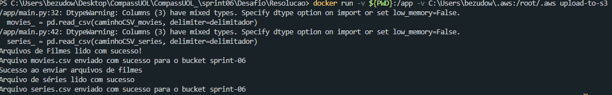
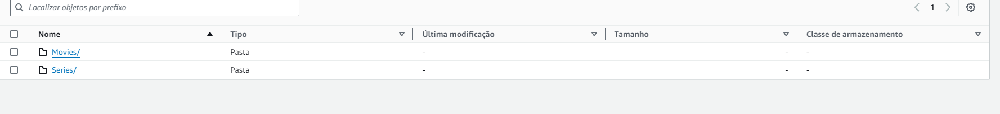
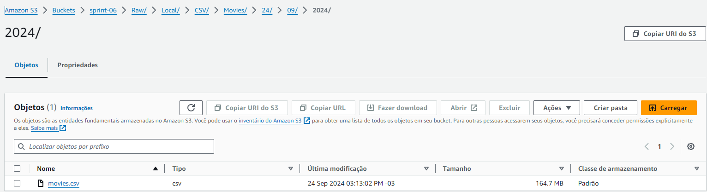
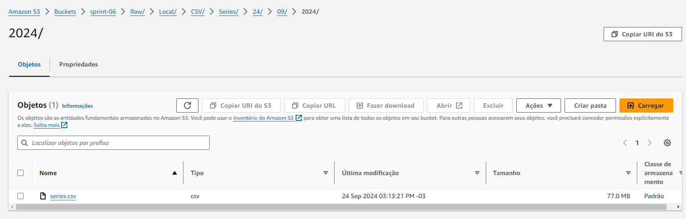
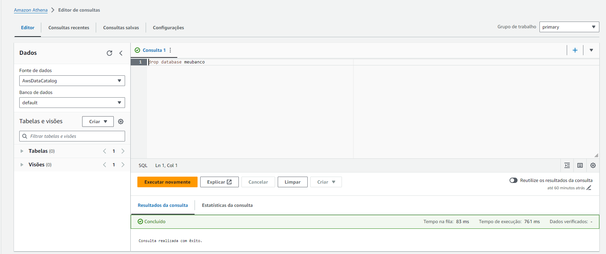
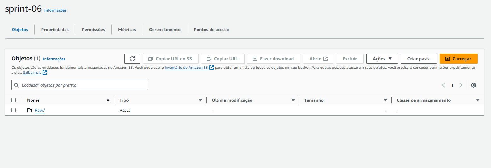
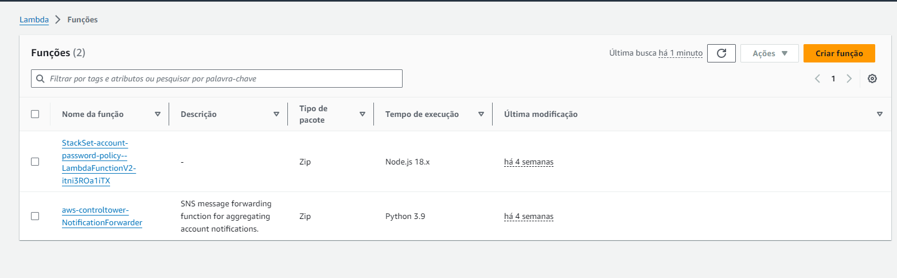

# **Evidencias**
## Evidencias do funcionamento do script *main.py*, que tem como objetivo realizar uploads de arquivos csv num S3 bucket

### Após executar o código, temos a confirmação no terminal: 
- Como solicitamos no script, temos a confirmação que os arquivos foram lidos e enviados com sucesso! 

### Podemos confirmar no Console AWS
- Dentro da pasta RAW

- É criado uma pasta para movies e series

- Dentro dessa pasta podemos localizar os arquivos brutos 

- Para finalizar, segue evidencias da limpeza dos arquivos como solicitado

**1.Limpeza Athena**

**2. Limpeza S3 Bucket**

**3. Limpeza Lambda**

