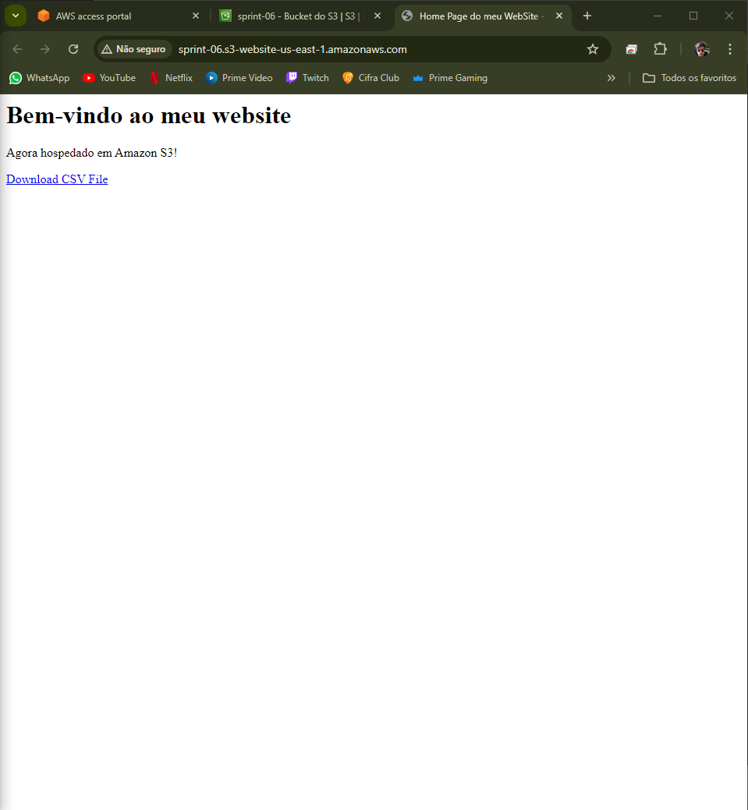
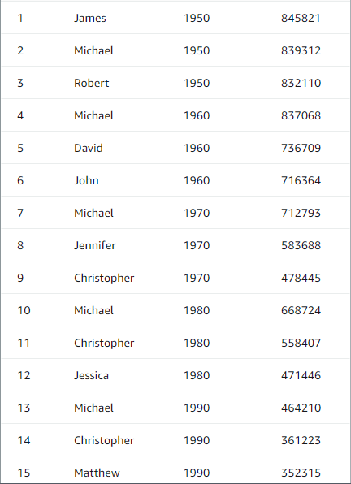
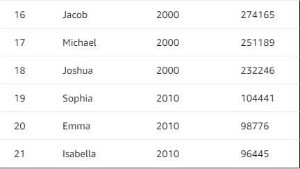
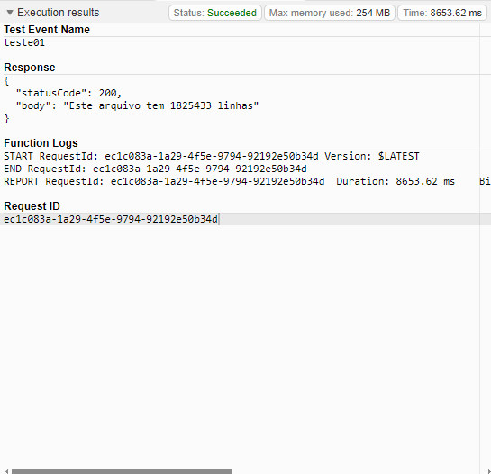

## Exercicio Lab AWS S3
- Após a conclusão do passo a passo temos como resultado a evidencia do website hospedado no S3


## Exercicio Lab AWS Athena
- Após a conclusão do passo a passo é solictado a criação de uma consulta que liste os 3 nomes mais usados em cada década desde o 1950 até hoje, e também o número de aparições.
- Consulta SQL:
```
SELECT nome, decada, total
FROM (
    SELECT 
        nome, 
        FLOOR(ano / 10) * 10 AS decada, 
        SUM(total) AS total,
        ROW_NUMBER() OVER (PARTITION BY FLOOR(ano / 10) * 10 ORDER BY SUM(total) DESC) AS quantidade_aparicoes
    FROM meubanco.names
    WHERE ano >= 1950
    GROUP BY nome, FLOOR(ano / 10) * 10
) AS ranked
WHERE quantidade_aparicoes <= 3
ORDER BY decada, total DESC;
```
1. Usamos a função *floor* para achar a decada do ano selecionado, ou seja:
```
FLOOR(ano / 10) * 10 AS decada, 
```
Se o ano for 1954, será feito o calculo (1954 / 10) = 195.4, aplicando o floor resultamos em 195, e ao multiplicar por 10, o resultado é 1950, dessa maneira representando a década. 




## Exercicio Lab AWS Lambda
- É solicitado no passo a passo da atividade a criação do runtime da function como *Python 3.7*, porém nos dias atuais o Amazon Linux não oferece mais suporte para tal, portanto, usei o *Python 3.11* como runtime da function. 
Vale lembrar também que para usar a nova versão foi necessario trocar a versão base do Amazon Linux de *amazonlinux:2.0.20200602.0* para *FROM amazonlinux:2023*
- Segue alterações feitas no código base oferecido no passo a passo para: 
```
FROM amazonlinux:2023

RUN yum update -y && \
    yum install -y python3.11 python3.11-pip zip && \
    yum clean all

RUN python3.11 -m pip install --upgrade pip
RUN python3.11 -m pip install numpy pandas
```
- Também foi necessario editar as configurações básicas da função, alterando o tamanho da memória para 256MB o tempo limite para 20seg
- Após as alterações temos como resultado: 

