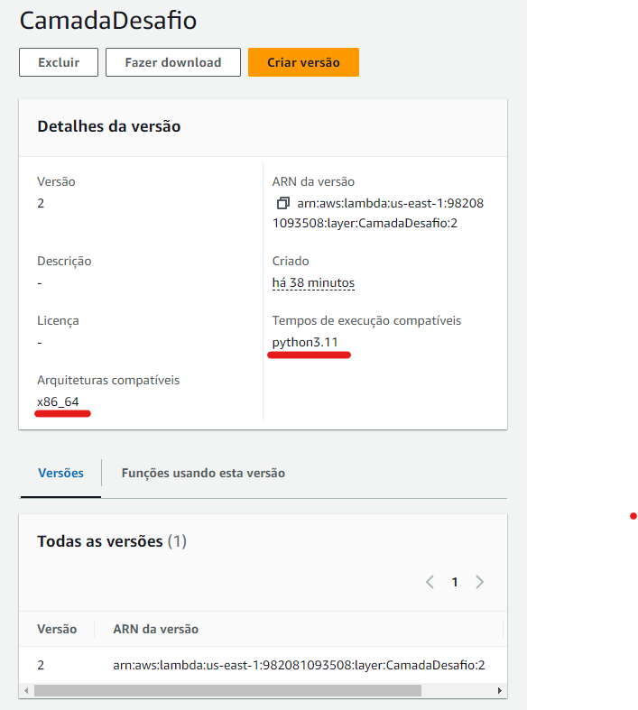
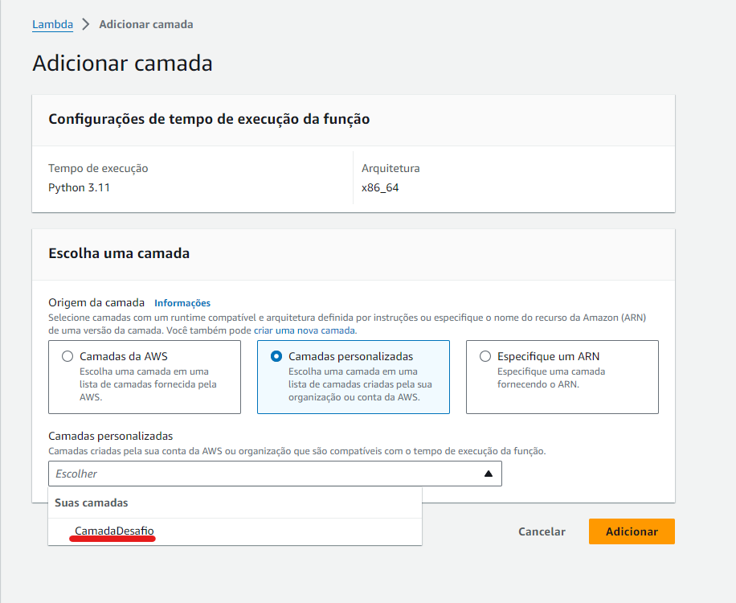
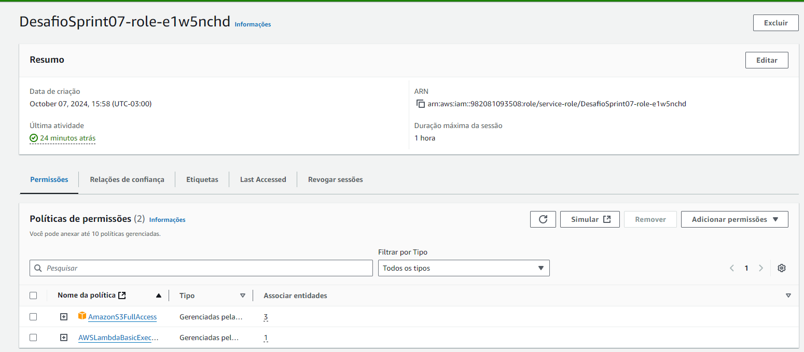

# **Desafio**
1. Objetivo: 
* Práticar a combinação de conhecimentos vistos no Programa, fazer um mix de tudo que já foi dito 
2. Atividade: 
* Capturar dados do TMDB via Lambda realizando chamadas de API, os dados coletados serão repartidos no bucket nas camadas RAW Zone, mantendo o formato JSON. 

## Passo 1
- Criação do *Dockerfile* para baixarmos as bibliotecas necessárias para colocar na lambda function (Usando como base o python 3.11)

1. Iniciamos indicando a versão base AmazonLinux compativel com python 3.11, em seguida atualizamos os pacotes do sistema e instalamos o python e pip 
```
FROM amazonlinux:2023

RUN yum update -y && \
    yum install -y python3.11 python3.11-pip zip && \
    yum clean all
```

2. Fazemos a atualização do pip para a versão mais recente, e instalamos as bibliotecas necessarias para o funcionamento do código.
```
RUN python3.11 -m pip install --upgrade pip
RUN python3.11 -m pip install numpy pandas boto3 python-dotenv
RUN python3.11 -m pip install tmdbv3api -t .
```
### [DockerFile Copleto](./Dockerfile)

## Passo 2
- Após extrairmos as bibliotecas em formato .zip, fazemos upload na mesma no bucket, e criamos uma nova camada na lambda. [Camada](./camada.zip)


## Passo 3
- Criação do script principal
1. Fazemos a importação da bibliotecas necessarias e baixadas anteriormente, e, definimos nossa API key do TMDb e inicializamos a biblioteca 
```
import json
import boto3
import os
from tmdbv3api import TMDb, Movie

TMDB_API_KEY = '03129dc562c7c51794b4fd34d2ca274b'
tmdb = TMDb()
tmdb.api_key = TMDB_API_KEY
```

2. Inicializamos o cliente S3 do boto3 e criamos a função principal
```
s3 = boto3.client('s3')

def lambda_handler(event, context):
    try:
        filme = Movie()
        id_filme = event.get("id_filme", 180) 
        detalhes_filme = filme.details(id_filme)
        dados_filme = detalhes_filme.__dict__
        dados_filme_serializáveis = {key: value for key, value in dados_filme.items() if isinstance(value, (dict, list, str, int, float, bool))}

        bucket_s3 = 'sprint07'
        data_atual = datetime.now()
        ano = data_atual.strftime("%Y")
        mes = data_atual.strftime("%m")
        dia = data_atual.strftime("%d")
        camada_armazenamento = "raw" 
        origem_dado = "TMDB"
        formato_dado = "JSON"
        especificacao_dado = "details"

        caminho_s3 = f"{camada_armazenamento}/{origem_dado}/{formato_dado}/{especificacao_dado}/{ano}/{mes}/{dia}/{id_filme}.json"
    
        s3.put_object(
            Body=json.dumps(dados_filme_serializáveis, ensure_ascii=False, indent=4),
            Bucket=bucket_s3,
            Key=caminho_s3
        )
```

## Passo 4
- Adicinamos a camada criada no Passo 2


## Passo 5
- Atualizamos as permissões da função para que consiga salvar dados dentro do bucket S3


### Para mais detalhes do código comentado
[Script main.py](../Desafio/main.py)


