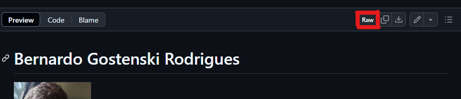
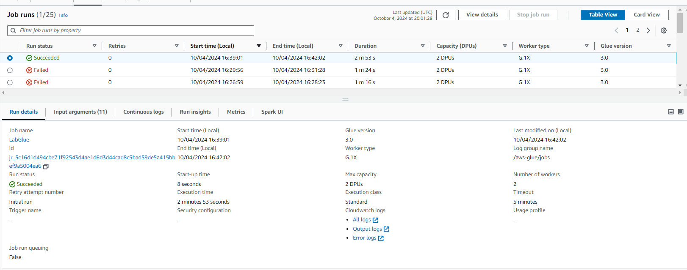
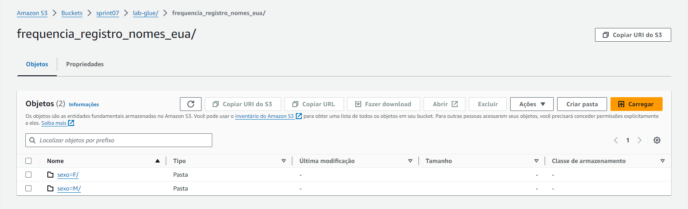
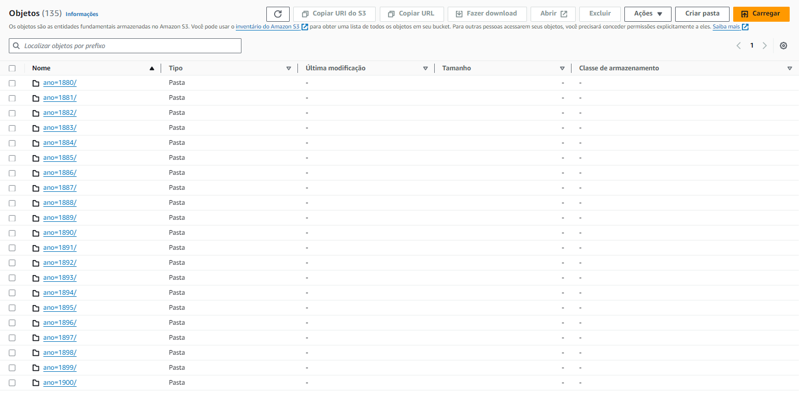
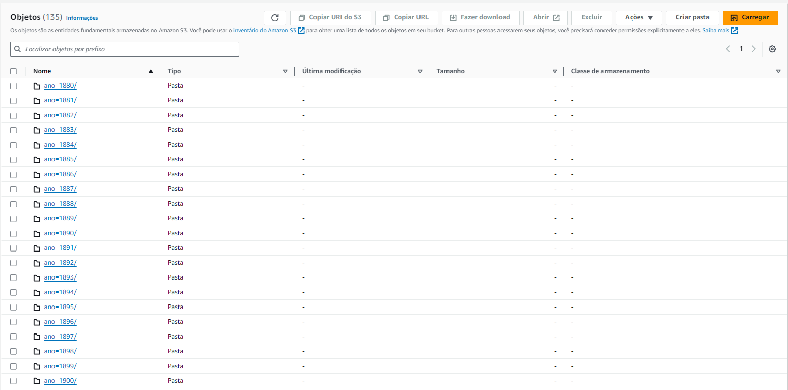
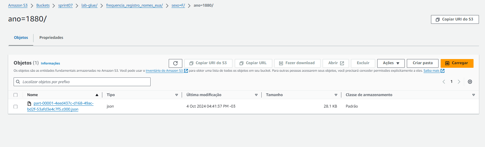
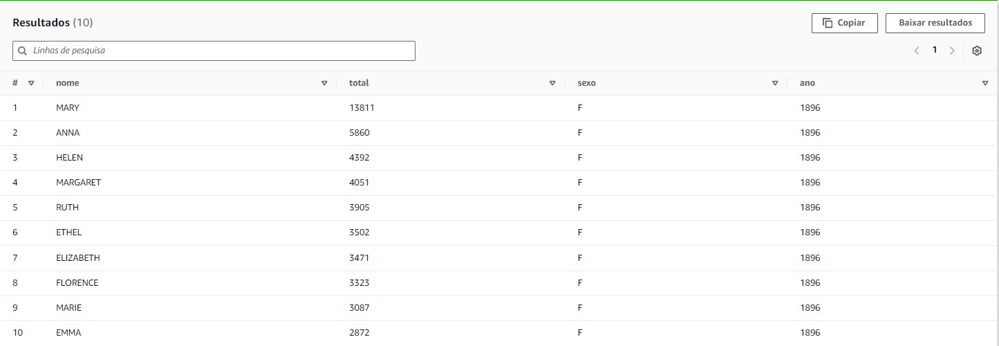

# Exercicio Apache-Spark
### Passo 1
- Iniciamos fazendo o download da imagem Docker com Spark e Jupyer com o comando 
``` 
docker pull jupyter/all-spark-notebook 
```
### Passo 2
- Criar um container com o Jupyer e Spark com o comando 
```
docker run -p 8888:8888 -it jupyter/app-spark-notebook
```
- Com isso vamos iniciar o Jupyer Lab e no terminal vamos receber um token e um link de acesso, por exemplo
*[I 2024-10-02 16:35:18.907 ServerApp]     http://127.0.0.1:2b91374cadfb7804b903324c9*

### Passo 3 
- Em um outro terminal executamos o comando *docker ps* e copiamos o ID do nosso container
- Então acessamos o bash do nosso container com o comando:
```
docker exec -it 97e7e159cd45 bash   
```
- Em seguida, entramos no GitHub, selecinamos o README.md, **imporante, o arquivo deve ser localizado como RAW**


- Enfim rodamos o comando abaixo para fazer download do arquivo: 
```
https://raw.githubusercontent.com/RodriguesBernardo/CompassUOL_/refs/heads/main/README.md?token=GHSAT0AAAAAACUUUND4BIMJ7DXP6PV5RBGAZX5PCNQ
``` 
- Conferimos o local que foi feito o download e se nao tivemos nenhum imprevisto com o comando com o comando *ls*

### Passo 4
- Acessamos o navegador com o link que conseguimos no *Passo 2*, para entrarmos no Jupyer Lab, então selecionamos o formato desejado

#### Criação do arquivo main.py
1. Importamos a biblioteca necessaria, inicializamos o *SparkContext*, e carregamos o *README.md* informando o caminho: 
```
from pyspark import SparkContext
sc = SparkContext.getOrCreate()
arquivo = sc.textFile("/home/jovyan/README.md")
```

2. Dividimos as linhas em palavras, criamos uma váriavel que armazena o total de palavras no arquivo
```
palavras = arquivo.flatMap(lambda line: line.split(" "))
total_palavras = palavras.count()
```
3. Criamos pares para cada palavra usando a função map e criamos a variavel contador, verificar as ocorrencias de cada palavra: 
```
paresPalavras = palavras.map(lambda word: (word, 1))
contador = paresPalavras.reduceByKey(lambda a, b: a + b)
```
4. Por fim, coletamos os resultados e mostramos na tela
```
contador.collect()
print(f"O numero total de palavras são: {total_palavras}")
```

#### Para mais detalhes sobre o código:
[CódigoCompleto](./Apache-Spark/main.ipynb)

# **Evidencias**
1. Após a execução do código temos como resultado: 


- Para mais detalhes do código: 
### [Código_Apache-Spark](../exercicios/Apache-Spark/main.ipynb)

# Exercicio Lab AWS GLUE

## Passo 1 (Criação do Script)
- Seguindo conforme o passo a passo sugerido no [Instruções PDF](./AWS_GLUE/glue-lab.pdf), podemos começar a montar nosso novo código: 
1. Realizar as importações necessarias, informar os argumentos passados no job e inicializar o Spark e Glue
```
import sys
from pyspark.context import SparkContext
from awsglue.context import GlueContext
from awsglue.job import Job
from awsglue.utils import getResolvedOptions
from pyspark.sql.functions import col, upper, count, desc

args = getResolvedOptions(sys.argv, ['JOB_NAME', 'S3_INPUT_PATH', 'S3_TARGET_PATH'])

sc = SparkContext()
glueContext = GlueContext(sc)
spark = glueContext.spark_session

job = Job(glueContext)
job.init(args['JOB_NAME'], args)
```

2. Definir variaveis para a entrada e saida dos argumentos(Somente para melhorar a organização do código), em seguida fazemos a leitura dos arquivo CSV, informando que temos cabeçalho e exibimos a estrutura do DataFrame
```
caminhoArquivoNomes = args['S3_INPUT_PATH']
caminhoDestinoArquivo = args['S3_TARGET_PATH']

arquivoNomes = spark.read.option("header", "true").csv(caminhoArquivoNomes)

arquivoNomes.printSchema()
```

3. Convertemos os valores da coluna *nome* para maiúsculas e contamos o numero total de linhas no DataFrame
```
arquivoNomesMaiusculo = arquivoNomes.withColumn("nome", upper(col("nome")))
numeroLinhas = arquivoNomesMaiusculo.count()
print(f"Número de linhas: {numeroLinhas}")
```

4. Agrupamos por *ano* e *sexo* e contamos os registros ordenando de maneira decresente, em seguida fazemos uma filtragem para sexo feminino e masculino, ordenando para pegar o mais frequente. 
```
arquivoAgrupadoPorAnoSexo = (
    arquivoNomesMaiusculo.groupBy("ano", "sexo")
    .agg(count("*"))
    .orderBy(col("ano").desc())
)
arquivoAgrupadoPorAnoSexo.show()

nomeFemininoMaisRegistrado = (
    arquivoNomesMaiusculo
    .filter(col("sexo") == "F")
    .groupBy("nome", "ano")
    .agg(count("*").alias("contagemNomes"))
    .orderBy(desc("contagemNomes"))
    .first()
)
print(f"Nome feminino com mais registros: {nomeFemininoMaisRegistrado['nome']} - Ano: {nomeFemininoMaisRegistrado['ano']}")

nomeMasculinoMaisRegistrado = (
    arquivoNomesMaiusculo
    .filter(col("sexo") == "M")
    .groupBy("nome", "ano")
    .agg(count("*").alias("contagemNomes"))
    .orderBy(desc("contagemNomes"))
    .first()
)
print(f"Nome masculino com mais registros: {nomeMasculinoMaisRegistrado['nome']} - Ano: {nomeMasculinoMaisRegistrado['ano']}")
```

5. Por final, contamos o numero de registros por ano e exibimos os 10 primeiros anos, e gravamos no DataFrame dividindo por sexo e ano
```
totalRegistros = arquivoNomesMaiusculo.groupBy("ano").agg(count("*")).orderBy("ano")
totalRegistros.limit(10).show()

arquivoNomesMaiusculo.write.mode("overwrite").partitionBy("sexo", "ano").json(caminhoDestinoArquivo)

job.commit()
```
# **Evidencias**
1. Após a execução do código temos como resultado: 







- Para mais detalhes do código: 
### [Código Main.py](./AWS_GLUE/main.py)