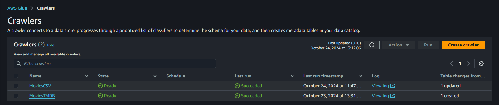
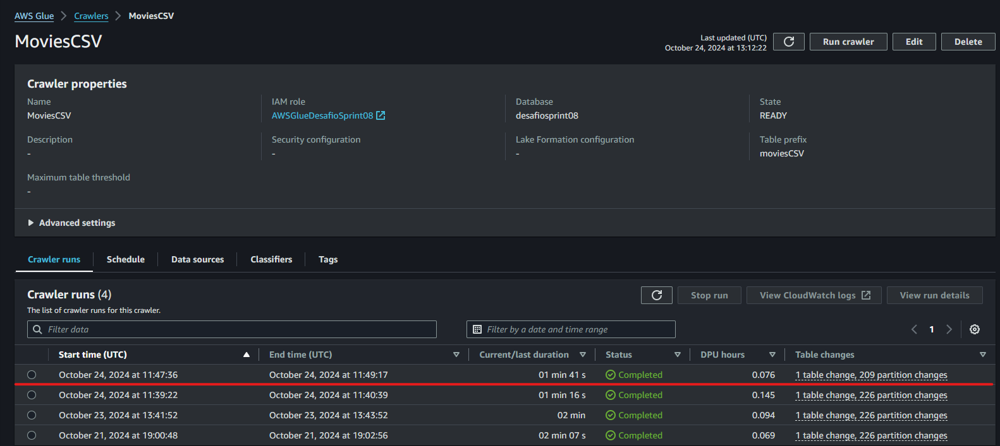

# **Desafio**
1. Objetivo: 
    - Passar os arquivos da camada RAW para camada Trusted, fazendo uma limpeza nos arquivos da maneira que fique mais adequado para responder as perguntas criadas
2. Perguntas a serem respondidas: 
    - Qual a relação entre a duração dos filmes e suas avaliações no TMDB e CSV
    - Quais atores têm o maior número de filmes no gênero? 
    - Quais filmes tiveram o maior número de avaliação em cada ano de lançamento
    - Quais atores têm o maior número de filmes no gênero Drama e Romance

## Passo 1
- Começamos fazendo a criação do script *mainCSV.py*, que tem como objetivo filtrar apenas os genêros *Drama* e *Romance*, limpar os dados duplicados e particionar com base em gênero e ano de lançamento!

### Etapa 1
- Informamos quais são as bibiotacas necessarias para a execução do código e logo em seguida iniciamos o glueContext e o SparkContext, também criamos as variaves que vao representar informações sobre a data assim como os caminhos do arquivo CSV e o arquivo destino na pasta *trusted*
```
import sys
from pyspark.context import SparkContext
from awsglue.context import GlueContext
from pyspark.sql.functions import array_contains, col, when, explode, lit
from datetime import datetime

sc = SparkContext()
glueContext = GlueContext(sc)
spark = glueContext.spark_session
data_atual = datetime.now()
ano = data_atual.strftime("%Y")
mes = data_atual.strftime("%m")
dia = data_atual.strftime("%d")
caminhoArquivoJSON = "s3://sprint07/raw/TMDB/JSON/2024/10/18/movies_2.json"
caminhoDestino = f"s3://sprint07/trusted/Movies_TMDb/{ano}/{mes}/{dia}/"
```

### Etapa 2
- Utilizamos PySpark para fazer a leitura do arquivo CSV e faz a filtragem para que apenas os filmes com os genêros desejados sejam incluidos no parquet.
- Em seguida removemos as duplicatas presentes na coluna *titulopincipal*.
```
filmes_df = spark.read.option("delimiter", "|").csv(caminhoArquivoSeries, header=True, inferSchema=True)

filmesDrama_Romance = filmes_df.filter((col("genero") == "Drama") | (col("genero") == "Romance"))

filmesDrama_Romance = filmesDrama_Romance.dropDuplicates(["titulopincipal"])
```

### Etapa 3
- Criamos uma laço de repetição para percorrer todas as colunas do CSV, e, onde temos valores nulo, vazio ou "/N" fazemos a substituição por "Desconhecido".
- Em seguida salvamos os dados no formato parquet
```
for coluna in filmesDrama_Romance.columns:
    filmesDrama_Romance = filmesDrama_Romance.withColumn(
        coluna,
        when(col(coluna).isNull() | (col(coluna) == '') | (col(coluna) == '\\N'), lit('Desconhecido')).otherwise(col(coluna))
    )

filmesDrama_Romance.write.mode("overwrite").partitionBy("genero", "anoLancamento").parquet(caminhoDestinoSeries)
```
### Para mais detalhes do código comentado: [Código Completo](./mainCSV.py)

## Passo 2
- Criação do script *mainJSON.py*, que tem como objetivo filtrar apenas os gêneros *Drama* e *Romance*, limpar os dados duplicados e particionar com base em gênero e ano de lançamento!

### Etapa 1
- Informamos as bibliotecas principais que vão ser utilizadas, em seguida inicializamos o Spark e o GlueContext, também fazemos a declaração das variaveis que vão armazenar informações de data.
- Definimos variaveis informando o caminho para a leitura do arquivo JSON e o caminho destino dentro da pasta trusted.
```
import sys
from pyspark.context import SparkContext
from awsglue.context import GlueContext
from pyspark.sql.functions import array_contains, col, when, explode, lit
from datetime import datetime

sc = SparkContext()
glueContext = GlueContext(sc)
spark = glueContext.spark_session

data_atual = datetime.now()
ano = data_atual.strftime("%Y")
mes = data_atual.strftime("%m")
dia = data_atual.strftime("%d")

caminhoArquivoJSON = "s3://sprint07/raw/TMDB/JSON/2024/10/18/movies_2.json"
caminhoDestino = f"s3://sprint07/trusted/Movies_TMDb/{ano}/{mes}/{dia}/"
```

### Etapa 2
- Utilizamos Spark para fazer a leitura dos arquivos JSON, em seguida fazemos a "explosão" do array com objetivo de desnormalizar o array em diversas linhas.
- Filtramos os gêneros para aceitar somente Romance ou Drama
- Logo após fazemos a remoção de duplicatas, removendo filmes que tenham titulos duplicados.

```
json_df = spark.read.json(caminhoArquivoJSON)
json_exploded = json_df.withColumn("genero", explode(col("genero")))
json_drama_romance = json_exploded.filter((col("genero") == "Drama") | (col("genero") == "Romance"))
json_drama_romance = json_drama_romance.dropDuplicates(["tituloprincipal"])
```

### Etapa 3
- Substituimos os valores nulos ou invalidos da coluna anoLancamento para "Desconhecido" e salvamos o arquivo em formato parquet
```
json_drama_romance = json_drama_romance.withColumn(
    "anoLancamento",
    when(col("anoLancamento").isNull() | (col("anoLancamento") == ''), lit('Desconhecido')).otherwise(col("anoLancamento"))
)

json_drama_romance.write.mode("overwrite").partitionBy("genero", "anoLancamento").parquet(caminhoDestino)
```
### Para mais detalhes do código comentado:[Código Completo](./mainJSON.py)

## Passo 3
- Preparação do ambiente na AWS, tendo em base o passo a passo disponibilizado para a execução da [Ativdade Glue](/sprint07/exercicios/AWS_GLUE/glue-lab.pdf), foram criados dois jobs, um para a execução dos arquivos CSV e outra para JSON


## Passo 4
- Após a execução do código com sucesso em ambos os casos (CSV e JSON), vamos fazer a criação do *Crawler*, para que consiga informar para o *AWS Athena* fazer a leitura dos arquivos
- Para isso foram criados dois crawlers, um para a execução dos arquivos CSV e JSON




## Conclusão
- Após a execução passo a passo, podemos notar que no athena temos a opção para fazer as consultas dos arquivos parquet que criamos.
## [Código Completo CSV](./mainCSV.py)
## [Código Completo JSON](./mainJSON.py)