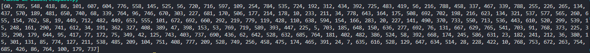
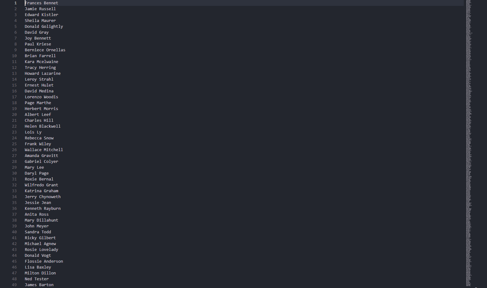
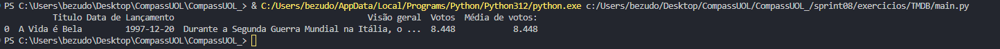

# Exercicio Apache-Spark
- Objetivo: Aplicar os recursos básicos de manipulação de dataframes através do framework Apache Spark

### Passo 1
- Para realizarmos a execução da atvidade vamos utilizar Docker, portanto vamos iniciar com a sua criação 

- Utilizamos a imagem oficial do spark como base:
```
FROM bitnami/spark:latest
```
- Definimos o diretorio de trabalho dentro do contêiner e copiamos o arquivo main.py e nomes_aleatorios.txt. Por fim executamos o código assim que iniciar o container
```
WORKDIR /app
COPY main.py .
COPY nomes_aleatorios.txt /app/
CMD ["spark-submit", "/app/main.py"]
```

### Passo 2
- Criação do script principal *main.py*, com suas consultas(selects) solicitados: 
```
import random
from pyspark.sql import SparkSession
from pyspark.sql.functions import udf
from pyspark.sql.types import StringType, IntegerType

spark = SparkSession \
    .builder \
    .master("local[*]") \
    .appName("Exercicio Intro") \
    .getOrCreate()

df_nomes = spark.read.csv("nomes_aleatorios.txt", inferSchema=True, header=False)
df_nomes = df_nomes.withColumnRenamed("_c0", "Nomes")

def escolaridade_aleatoria():
    return random.choice(["Fundamental", "Medio", "Superior"])

escolaridade_udf = udf(escolaridade_aleatoria, StringType())
df_nomes = df_nomes.withColumn("Escolaridade", escolaridade_udf())

paises = ["Argentina", "Brasil", "Chile", "Uruguai", "Paraguai", "Peru", 
          "Bolívia", "Equador", "Colômbia", "Venezuela", "Guiana", 
          "Suriname", "Guiana Francesa"]

def pais_aleatorio():
    return random.choice(paises)

pais_udf = udf(pais_aleatorio, StringType())
df_nomes = df_nomes.withColumn("Pais", pais_udf())

def ano_nascimento_aleatorio():
    return random.randint(1945, 2010)

ano_nascimento_udf = udf(ano_nascimento_aleatorio, IntegerType())
df_nomes = df_nomes.withColumn("AnoNascimento", ano_nascimento_udf())

df_select = df_nomes.filter(df_nomes["AnoNascimento"] >= 2000)
df_select.select("Nomes").show(10)

df_nomes.createOrReplaceTempView("pessoas")

df_select_sql = spark.sql("SELECT Nomes FROM pessoas WHERE AnoNascimento >= 2000")
df_select_sql.show(10)

df_millennials = df_nomes.filter((df_nomes["AnoNascimento"] >= 1980) & (df_nomes["AnoNascimento"] <= 1994))
millennials_count = df_millennials.count()
print(f"Número de Millennials: {millennials_count}")

df_millennials_sql = spark.sql("SELECT COUNT(*) FROM pessoas WHERE AnoNascimento >= 1980 AND AnoNascimento <= 1994")
df_millennials_sql.show()

df_generations = spark.sql("""
    SELECT Pais, 
           CASE 
               WHEN AnoNascimento BETWEEN 1944 AND 1964 THEN 'Baby Boomers'
               WHEN AnoNascimento BETWEEN 1965 AND 1979 THEN 'Geracao X'
               WHEN AnoNascimento BETWEEN 1980 AND 1994 THEN 'Millennials'
               WHEN AnoNascimento BETWEEN 1995 AND 2015 THEN 'Geracao Z'
           END AS Geracao, 
           COUNT(*) AS Quantidade
    FROM pessoas
    GROUP BY Pais, Geracao
    ORDER BY Pais, Geracao
""")
df_generations.show()
```
- Após a sua execução, podemos ver como resultado:

1. 10 nomes de pessoas nascidas a partir do ano 2000

```
+-----------------+
|            Nomes|
+-----------------+
|   Edward Kistler|
|     Charles Hill|
|  Jerry Chynoweth|
|      Donald Vogt|
|    Milton Dillon|
|    Lynne Dustman|
|Marguerite Rankin|
|   Roger Guenther|
|      John Snipes|
|       Lori Allee|
+-----------------+
```
2. Conta o numero de pessoas da geração Millennial

```
+--------+
|count(1)|
+--------+
| 2272300|
+--------+
```
3. Classifica a quantidade de pessoas com base no ano de nascimento

```
+---------+------------+----------+
|     Pais|     Geracao|Quantidade|
+---------+------------+----------+
|Argentina|Baby Boomers|    233842|
|Argentina|   Geracao X|    174799|
|Argentina|   Geracao Z|    186122|
|Argentina| Millennials|    174725|
|  Bolívia|Baby Boomers|    233384|
|  Bolívia|   Geracao X|    174843|
|  Bolívia|   Geracao Z|    186300|
|  Bolívia| Millennials|    174523|
|   Brasil|Baby Boomers|    234244|
|   Brasil|   Geracao X|    175063|
|   Brasil|   Geracao Z|    186193|
|   Brasil| Millennials|    174114|
|    Chile|Baby Boomers|    233200|
|    Chile|   Geracao X|    174254|
|    Chile|   Geracao Z|    186195|
|    Chile| Millennials|    174886|
| Colômbia|Baby Boomers|    233939|
| Colômbia|   Geracao X|    173930|
| Colômbia|   Geracao Z|    185922|
| Colômbia| Millennials|    174337|
+---------+------------+----------+
```

# Exercicio Geração e Massa de Dados
- Esse exercicio foi separados em 3 etapas, onde uma tem sua execução individual

### Etapa 1: 
- Objetivo de inicializar uma lista contendo 250 numeros inteiros obtidos de forma aleatória
```
import random
numAleatorios = [random.randint(1, 800) for _ in range(250)]
numAleatorios.reverse()
print(numAleatorios)
```


### Etapa 2:
- Objetivo de ordenar uma lista com o nome de 20 animais em ordem crescente, em sequencia armazenamos o conteudo em um arquivo de texto
```
animais = [
    'Cachorro', 'Gato', 'Arara', 'Baleia', 'Tigre', 'Girafa',
    'Zebra', 'Galo', 'Foca', 'Panda', 'Cavalo', 'Coelho',
    'Elefante', 'Coruja', 'Cobra', 'Macaco', 'Lobo', 'Urso',
    'Pato', 'Leao', 'Hipopotamo'
]
animais.sort()
for animal in animais:
    print(animais)


with open('animais.csv','w') as arquivo:
    for animal in animais:
        arquivo.write(f'{animal}\n')

```
#### [Resultado](./Geracao%20e%20Massa%20de%20Dados/animais.csv)

### Etapa 3:
- Elaborar um código para gerar um dataset de nomes de pessoas. 
```
import random
import names
import time 
import os

random.seed(40)

qtd_nomes_unicos = 3000
qtd_nomes_aleatorios = 10000000

aux = []
for i in range(qtd_nomes_unicos):
    aux.append(names.get_full_name())
print(f'Gerando {qtd_nomes_aleatorios} nomes aleatórios...')

dados = []
for i in range(qtd_nomes_aleatorios):
    dados.append(random.choice(aux))

nomeArquivo = 'nomes_aleatorios.txt'
with open(nomeArquivo,'w') as arquivo:
    for nome in dados:
        arquivo.write(f'{nome}\n')

print(f"o arquivo {nomeArquivo} foi gerado com sucesso!")
```
- Imamgem do arquivo gerado *(Foi adicionado no .gitignore pois o arquivo é maior que 100MB)*


# Exercicio TMDB:
- Realizar a criação de um processo de extração de dados utilizando a API do TMDB

```
import requests
import pandas as pd 
from IPython.display import display
from dotenv import load_dotenv
import os


load_dotenv()

api_key = os.getenv('API_KEY')

url = f'https://api.themoviedb.org/3/movie/top_rated?api_key={api_key}&language=pt-BR'

response = requests.get(url)
data = response.json()

filmes = []

for movie in data['results']:
    df = {'Titulo': movie['title'],
          'Data de Lançamento': movie['release_date'],
          'Visão geral': movie['overview'],
          'Votos': movie['vote_average'],
          'Média de votos:':movie['vote_average']}

filmes.append(df)

df = pd.DataFrame(filmes)
display(df)
```
