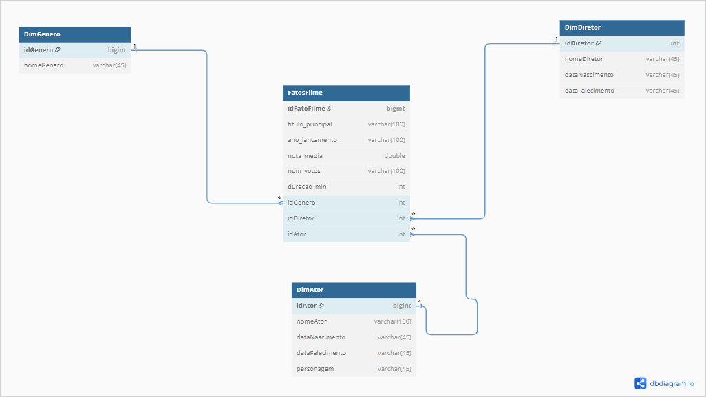
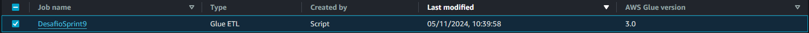
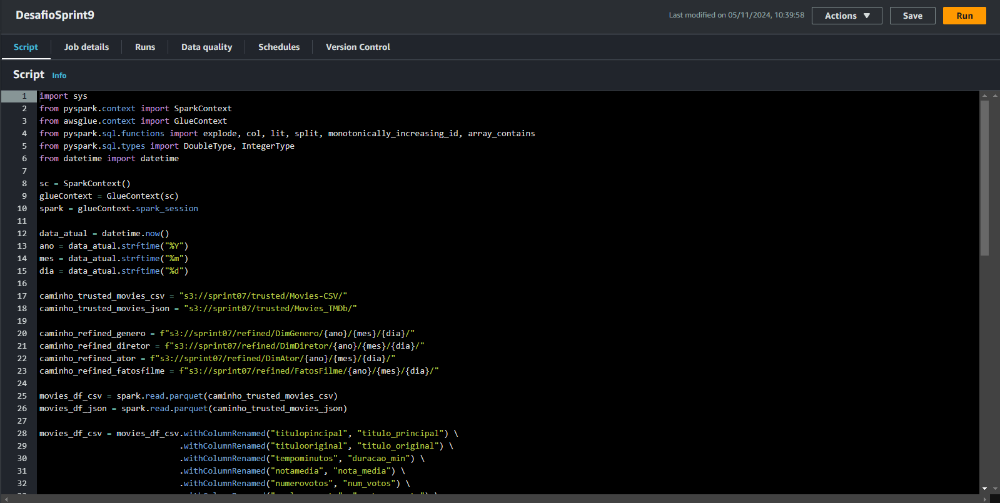
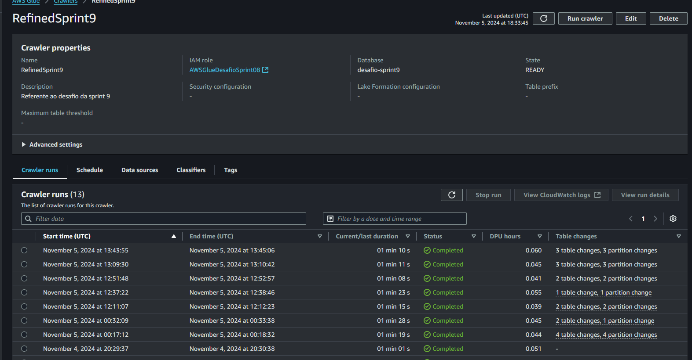
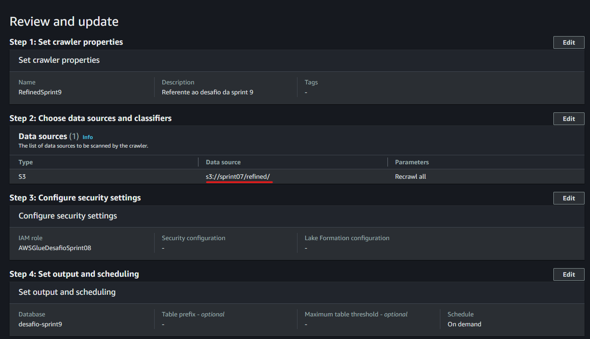
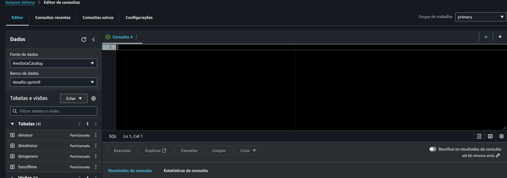

# **Desafio**
1. Objetivo: 
    - Refinar os dados da camada *trusted* na nova camada *trusted* usando AWS GLUE e Spark 

## Passo 1 
- Inicialmente fazemos uma breve análise dos dados no formato parquet, identificando a melhor maneira para realizar a modelagem 
- Escolhi a modelagem dimensional em formato de estrela (star schema) fazendo a criação de tabelas dinamicas(genero, ator e diretor) e a tabela fato (filmes) da seguinte maneira: 


## Passo 2
- Criação do script *main.py* que sera executado no AWS Glue para que faça o refinamento da camada trusted, criando tabelas dimensionais e tabela fato para melhor análise.

### Etapa 1
- Inicialização do GlueContext e SparkContext, posteriormente criamos variaveis para definir: Informações de data, caminhos para localização dos arquivos na trusted, caminho para criação dos arquivos na pasta refined
```
data_atual = datetime.now()
ano = data_atual.strftime("%Y")
mes = data_atual.strftime("%m")
dia = data_atual.strftime("%d")

caminho_trusted_movies_csv = "s3://sprint07/trusted/Movies-CSV/"
caminho_trusted_movies_json = "s3://sprint07/trusted/Movies_TMDb/"
caminho_refined_genero = f"s3://sprint07/refined/DimGenero/{ano}/{mes}/{dia}/"
caminho_refined_diretor = f"s3://sprint07/refined/DimDiretor/{ano}/{mes}/{dia}/"
caminho_refined_ator = f"s3://sprint07/refined/DimAtor/{ano}/{mes}/{dia}/"
caminho_refined_fatosfilme = f"s3://sprint07/refined/FatosFilme/{ano}/{mes}/{dia}/"
```

### Etapa 2
- A etapa 2 tem foco na união dos arquivos CSV e JSON em um unico dataFrame
- Carregamos os dados trusted, posteriormente renomeamos as colunas do CSV e JSON para ficarem amobs padronizados
- Ápos adicionamos colunas nulas no JSON que são exclusivas do CSV para que não ocorra erro na união
- Por fim unimos os dados CSV e JSON
```
movies_df_csv = spark.read.parquet(caminho_trusted_movies_csv)
movies_df_json = spark.read.parquet(caminho_trusted_movies_json)

movies_df_csv = movies_df_csv.withColumnRenamed("titulopincipal", "titulo_principal") \
                             .withColumnRenamed("titulooriginal", "titulo_original") \
                             .withColumnRenamed("tempominutos", "duracao_min") \
                             .withColumnRenamed("notamedia", "nota_media") \
                             .withColumnRenamed("numerovotos", "num_votos") \
                             .withColumnRenamed("anolancamento", "anoLancamento") \
                             .withColumn("nota_media", col("nota_media").cast(DoubleType())) \
                             .withColumn("duracao_min", col("duracao_min").cast(IntegerType()))

movies_df_json = movies_df_json.withColumnRenamed("tituloprincipal", "titulo_principal") \
                               .withColumnRenamed("titulooriginal", "titulo_original") \
                               .withColumnRenamed("tempominutos", "duracao_min") \
                               .withColumnRenamed("notamedia", "nota_media") \
                               .withColumnRenamed("numerovotos", "num_votos") \
                               .withColumnRenamed("anolancamento", "anoLancamento") \
                               .withColumn("nota_media", col("nota_media").cast(DoubleType())) \
                               .withColumn("duracao_min", col("duracao_min").cast(IntegerType()))

movies_df_json = movies_df_json \
    .withColumn("generoArtista", lit(None).cast("string")) \
    .withColumn("personagem", lit(None).cast("string")) \
    .withColumn("nomeartista", lit(None).cast("string")) \
    .withColumn("anonascimento", lit(None).cast("string")) \
    .withColumn("anofalecimento", lit(None).cast("string")) \
    .withColumn("profissao", lit(None).cast("string")) \
    .withColumn("titulosmaisconhecidos", lit(None).cast("string"))

dados_combinados = movies_df_csv.unionByName(movies_df_json, allowMissingColumns=True)
dados_combinados = dados_combinados.withColumn("profissao", split(col("profissao"), ","))
```

### Etapa 3
- Fazemos a criação das dimensões genêro, diretor, ator e Fatos filme
```
dim_genero = dados_combinados.select("genero").distinct() \
                             .withColumnRenamed("genero", "nomeGenero") \
                             .withColumn("idGenero", monotonically_increasing_id())
dim_genero.write.mode("overwrite").parquet(caminho_refined_genero)

dim_diretor = dados_combinados.filter(array_contains(col("profissao"), "director")) \
                              .select("nomeartista", "anonascimento", "anofalecimento").distinct() \
                              .withColumnRenamed("nomeartista", "nomeDiretor") \
                              .withColumn("idDiretor", monotonically_increasing_id())
dim_diretor.write.mode("overwrite").parquet(caminho_refined_diretor)

dim_ator = dados_combinados.filter(array_contains(col("profissao"), "actor")) \
                           .select("nomeartista", "anonascimento", "anofalecimento", "personagem").distinct() \
                           .withColumnRenamed("nomeartista", "nomeAtor") \
                           .withColumn("idAtor", monotonically_increasing_id())
dim_ator.write.mode("overwrite").parquet(caminho_refined_ator)

fatos_filme = dados_combinados.select(
    "titulo_principal", "titulo_original", "anoLancamento", col("nota_media").cast(DoubleType()), 
    "num_votos", col("duracao_min").cast(IntegerType()), "genero"
).withColumn("idFatoFilme", monotonically_increasing_id())
fatos_filme.write.mode("overwrite").parquet(caminho_refined_fatosfilme)
```

## Passo 3
- Criação do JOB no AWS Glue e execução do script 




## Passo 4
- Ápos a execução do script vamos fazer a criação do crawler para podermos realizar consultas com AWS Athena


- Informamos o caminho até o inicio do particionamento no S3


## Passo 5
- Por fim após executarmos o Crawler, podemos acessar o athena e verificar se podemos acessar as tabelas



