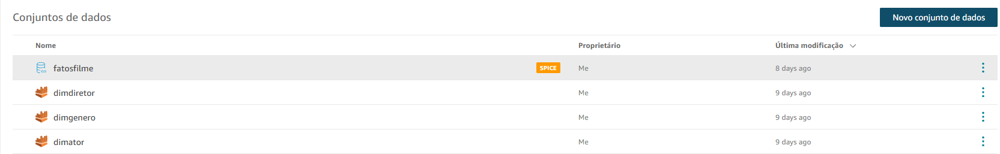
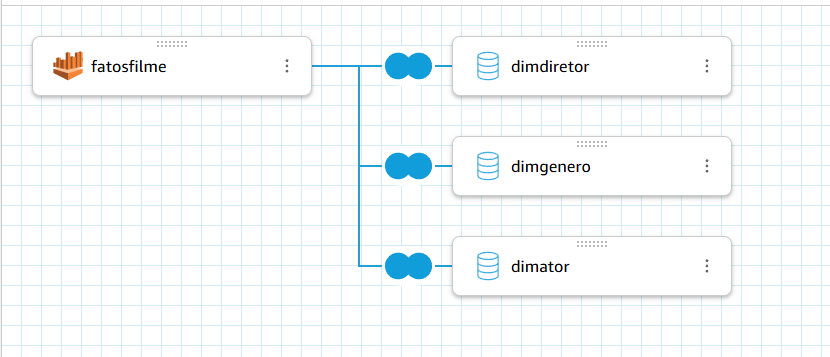
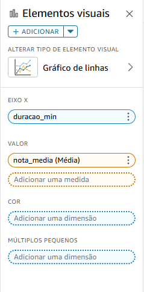
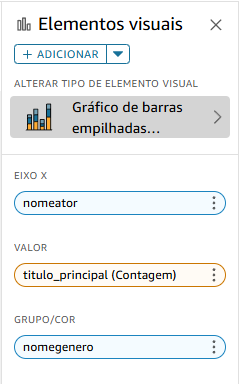
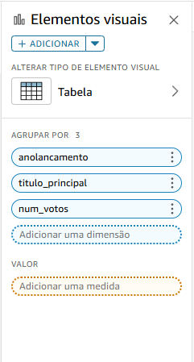
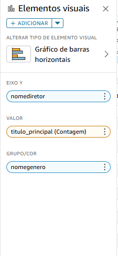

# **Desafio**
1. Objetivo: 
- Responder apresentando no quicksight as perguntas criadas:
    - Qual a relação entre a duração dos filmes e suas avaliações ? 
    - Quais atores têm o maior número de filmes no gênero? 
    - Quais filmes tiveram o maior número de avaliação em cada ano de lançamento?
    - Quais diretores têm o maior número de filmes no gênero?

## Passo 1 
- Criação dos conjuntos de dados no quicksight com objetivo de iniciar a análise, 
- Para isso foram criado conjutos de dados para todas as tabelas(dimensões e fato)

## Passo 2
- Após a criação dos conjuntos de dados, vamos fazer um *FULLJOIN* das tabelas dimensões com a fato, da seguinte maneira: 

## Passo 3
- Criação dos gráficos 

### Qual a relação entre a duração dos filmes e suas avaliações ? 
- Usando gráfico de linhas para melhor representação, fazemos a seguinte configuração para gerar o gráfico da maneira correta:
- Informamos no campo **EIXO X** o valor: *duracao_min*, e no campo **VALOR**: *nota_media* com agregação média  

### Quais atores têm o maior número de filmes no gênero? 
- Usando gráfico de barras empilhadas para melhor representação, fazemos a seguinte configuração para gerar o gráfico da maneira correta:
- Informamos no campo **EIXO X** o valor:  *nomeator*, e no campo **VALOR**: *titulo_principal* com agregação contagem 

### Quais filmes tiveram o maior número de avaliação em cada ano de lançamento?
- Usando uma tabela para melhor representação, fazemos a seguinte configuração para gerar o gráfico da maneira correta: 
- Informamos nos campos **AGRUPAR POR 3** os seguintes valores: *anolancamento*, *titulo_principal* e *num_votos*

### Quais diretores têm o maior número de filmes no gênero?
- Usando gráficos de barras horizontais para melhor representação, fazemos a seguinte configuração para gerar o gráfico da maneira correta:
- Informamos nos campos **EIXO Y** o valor: *nomediretor*, no campo *VALOR*: *titulo_principal* com agregação contagem, e por fim no campo **GRUPO/COR**: *nomegenero*  
